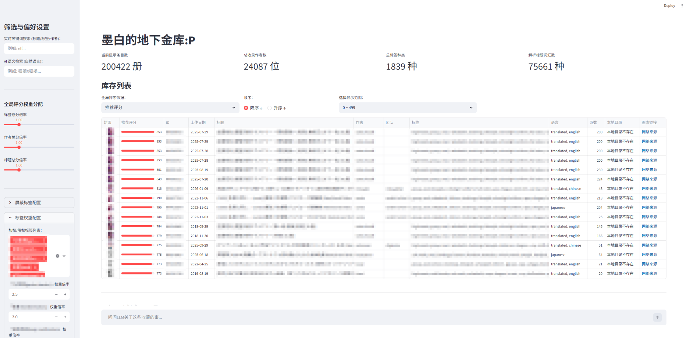
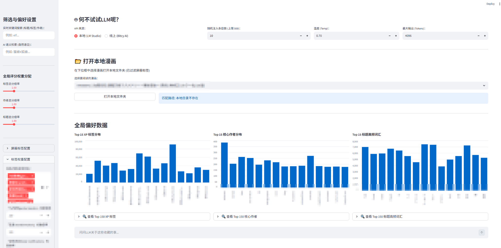
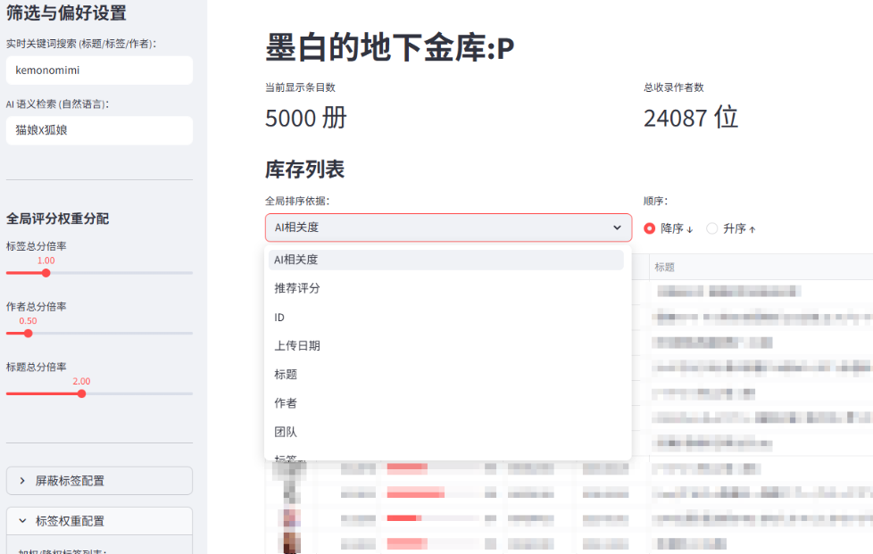
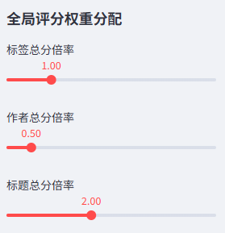
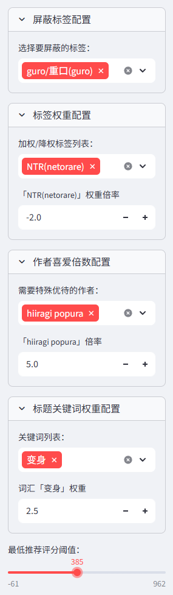
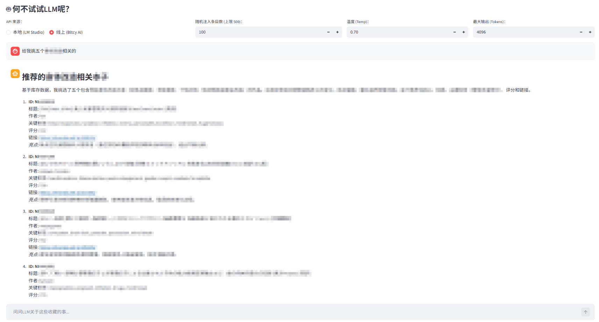
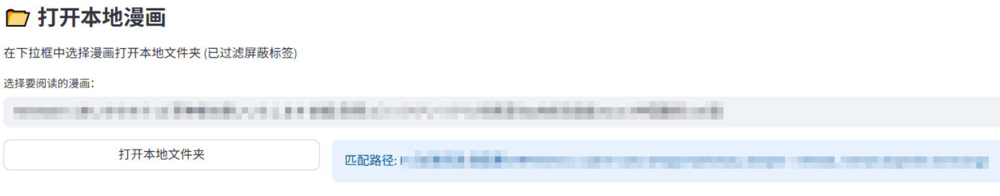

# XP-Gacha / 地下金库

争做最强大的本子推荐系统（误

一个基于 `Streamlit` 的本地（正经？）漫画库存管理、检索与推荐系统。

将「在线抓取 / 本地链接整理 / CSV 清洗 / MySQL 入库 / 标题分词 / 标签语义聚合 / 向量语义检索 / LLM 问答」串成了一条完整流程，搭建个人专属本子资料库、个人 XP 标签筛选器和线上&本地图库浏览器。

当前实现明显偏向 Windows 本地环境使用：

- 支持直接打开本地文件夹（`os.startfile`）
- 默认配置里使用了 Windows 绝对路径
- 本地模型与图库目录默认按本地磁盘组织

## 界面预览




## ✨ 功能概览

- 基于MySQL数据库读取漫画元数据并缓存预处理结果
- 按标签、作者、标题关键词进行动态推荐评分
- 标签评分基于语义聚合后的标签词频
- 支持屏蔽标签、权重调节、分数阈值筛选
- 支持普通关键词搜索，支持检索 `ID`, `标题`, `标签`, `作者`, `团队`
- 支持本地向量模型的自然语言语义检索
- 支持上传图片或输入库内 `ID` 的封面相似检索（CLIP）
- 支持展示封面缩略图、来源链接和本地目录
- 支持在界面中直接打开本地漫画文件夹
- 支持将当前筛选结果注入给 LLM 做RAG增强检索问答
- 支持 nhentai源(以下简称`NH`) / 禁漫天堂源(以下简称`JM`) 双源抓取、修复抓取和本地链接补抓
- 支持全量导库、增量导库、向量库重建与封面 Base64 预编码

### 检索排序



### 全局权重分配



### 标签屏蔽/权重调节/评分下限屏蔽



### RAG-LLM检索对话



### 本地路径打开



## 🧮 推荐评分算法

推荐分当前由三部分组成：

- 标签分：基于语义聚合后的标签词频、标签权重和全局倍率
- 作者分：基于作者出现频次和作者偏好倍率
- 标题分：基于标题分词后的高频词和词权重

当前实现为了减少大数据量下的权重拖动延迟，已经将评分链路改为“预处理阶段编码，交互阶段批量计算”：

- 预处理缓存中会额外保存标签稀疏矩阵、标题词稀疏矩阵、作者索引编码、每行标签数/标题词数等评分缓存
- 运行时会把用户侧边栏输入的动态权重字典转成权重向量
- 标签分与标题分通过稀疏矩阵乘法批量计算
- 作者分通过作者索引数组直接查表计算
- 最终仍保持和原先逐行评分一致的公式口径与整数结果

也就是说，当前 `apply_dynamic_scores()` 已不再逐行 `DataFrame.apply(axis=1)` 评分，而是基于 `numpy + scipy.sparse.csr_matrix` 批量完成整列推荐分计算。

默认展示排序为：

- `推荐评分` 降序
- 次级 `上传日期` 降序

## 🗂️ 项目结构

```text
XP-Gacha/
├─ app.py                                  # 本地主界面
├─ config_empty.py                         # 配置模板
├─ config.py                               # 本地实际配置
├─ data_pipeline.py                        # 数据读取、缓存、标签/标题处理、动态评分
├─ utils_charts.py                         # 偏好图表缓存与渲染
├─ utils_core.py                           # 本地目录匹配、封面缩略图与 Base64 缓存
├─ utils_nlp.py                            # 标题分词、语义检索模型加载
├─ utils_cv.py                             # CLIP 封面向量读取、上传图/ID 相似检索
├─ utils_chat.py                           # LLM 对话与流式输出
├─ data_processing/
│  ├─ img_to_vector.py                     # 构建/查询 CLIP 封面向量索引
│  ├─ add_csv_to_mysql.py                  # 增量导库
│  ├─ addname.py                           # 从本地链接列表补文件名
│  ├─ all_csv_to_mysql.py                  # 全量导库
│  ├─ b64_pre_encode.py                    # 预编码 Base64 缓存
│  ├─ build_vector_db.py                   # 重建向量库
│  ├─ map_add_name.py
│  ├─ tag_set.py
│  └─ title_cut_set.py
├─ .streamlit/
│  ├─ config.toml                          # Streamlit 主题配置
│  └─ secrets.toml                         # MySQL 密钥配置
├─ dictionaries/                           # 停用词、语义映射等字典资源
├─ data/
│  ├─ gallery_info/                        # 标准化 CSV
│  ├─ gallery_info_no_name/                # 原始抓取 CSV
│  └─ local_data/                          # 本地链接列表输入
├─ data_get/
│  ├─ NH_get_info_online.py                # NH 在线抓取
│  ├─ NH_get_info_online_fix.py            # NH 失败页重试
│  ├─ JM_get_info_online.py                # JM 在线抓取
│  ├─ JM_get_info_online_fix.py            # JM 失败页重试
│  └─ local/
│     ├─ NH_get_info_local.py              # NH 本地链接抓信息
│     └─ NH_get_images_local.py            # NH 本地链接抓完整漫画
├─ tools/                                  # 一些工具脚本
├─ Integration/
│  ├─ ScoringFormula_local.py              # 本地整合版(old)
│  └─ ScoringFormula_online.py             # 线上整合版
├─ manga_vectors/                          # 文本语义向量与图片向量索引
├─ onlineimgtmp/                           # 在线封面缩略图缓存
├─ localimgtmp/                            # 本地封面缩略图缓存
├─ b64_cache/                              # Base64 封面缓存
├─ b64_tmp/                                # Base64 增量临时目录
├─ datacache/                              # DataFrame 预处理缓存
└─ Qwen3-Embedding-0.6B/                   # embedding 预训练模型
```

## 数据流

1. 通过 `NH` / `JM` 抓取脚本或本地链接脚本生成 CSV。
2. CSV 统一规范到 `ID` 首列。
3. 将 `data/gallery_info/*.csv` 导入 MySQL 表 `gallery_info`。
4. 数据库表以 `ID` 为唯一索引。
5. 用数据库数据构建向量库，向量 `ids` 也使用 `ID`。
6. 启动 `app.py` 后，从数据库读取数据并做预处理缓存。
7. 页面中按照推荐评分、关键词、语义检索、封面相似检索结果进行筛选和展示。
8. 缩略图显示优先命中 Base64 缓存，其次在线图，最后本地图回退。

## 💻 运行环境

建议环境：

- Python `3.10+`
- Windows
- 可用的 MySQL 实例
- 本地 embedding 模型
- 本地 CLIP 模型
- 如需本地LLM聊天：已启动的 `LM Studio` 兼容接口

安装依赖：

```bash
pip install -r requirements.txt
```

如果你手动装包，至少需要：

```bash
pip install streamlit pandas numpy scipy sqlalchemy pymysql pillow janome sentence-transformers torch requests curl-cffi beautifulsoup4 cloudscraper tomli
```

如果你要使用 `data_processing/img_to_vector.py` 或主界面的封面相似检索，还需要：

```bash
pip install transformers
```

## ⚙️ 如何开始

### 1. 创建 `config.py`

```powershell
copy config_empty.py config.py
```

然后按本机环境修改：

- `BASE_DIR`：本地漫画根目录
- `LOCAL_MODEL_PATH`：本地 embedding 模型目录
- `VECTOR_FILE`：文本语义向量文件输出位置
- `IMG_VECTOR_FILE`：封面向量索引文件位置
- `CLIP_MODEL_PATH`：本地 CLIP 模型目录
- `SEMANTIC_SEARCH_TOP_K`：语义检索最多保留的候选数
- `COVER_SEARCH_TOP_K`：封面相似检索最多保留的候选数
- `LM_STUDIO_API_BASE` / `LM_STUDIO_MODEL`
- `ONLINE_API_BASE` / `ONLINE_API_KEY` / `ONLINE_MODEL`
- `INITIAL_TAG_WEIGHTS`
- `MAX_DISPLAY`

### 2. 配置数据库密钥

`.streamlit/secrets.toml`：

```toml
[mysql]
user = "your_database_name"
password = "your_database_password"
host = "127.0.0.1"
port = 3306
database = "gallery_info"
```

### 3. 自定义主题色

项目使用 `Streamlit` 的项目级主题配置文件：

- `.streamlit/config.toml`

当前仓库已经内置了一套浅色和深色主题，你可以直接修改里面的颜色值：

```toml
[theme]
primaryColor = "#755bbb"

[theme.light]
backgroundColor = "#FFFDF8"
secondaryBackgroundColor = "#F3EEE7"
textColor = "#1F1F1F"
borderColor = "#D9D1C7"

[theme.dark]
backgroundColor = "#121714"
secondaryBackgroundColor = "#1D2520"
textColor = "#EAF2EC"
borderColor = "#334039"
```

各字段含义：

- `primaryColor`：主强调色，影响按钮、链接、高亮控件等
- `backgroundColor`：页面主背景色
- `secondaryBackgroundColor`：侧边栏、输入框、面板等区域背景色
- `textColor`：主要文字颜色
- `borderColor`：边框颜色

使用方式：

1. 打开 `.streamlit/config.toml`
2. 修改浅色或深色主题下对应的颜色值
3. 保存文件
4. 刷新页面；如果没有立即生效，重启 `streamlit run app.py`

深浅色模式切换：

- 应用右上角 `⋮` -> `Settings`
- 在 `Theme` 中切换 `Light` / `Dark`

### 4. 准备字典与模型资源

默认会读取：

- `dictionaries/STOP_TAGS.txt`
- `dictionaries/SEMANTIC_MAP.json`
- `dictionaries/TITLE_STOP_WORDS.txt`
- `dictionaries/TITLE_SEMANTIC_MAP.json`
- `config.py` 中指定的本地 embedding 模型目录与本地 CLIP 模型目录

### 📖 字典与 XP 语义聚合说明

`dictionaries/` 里当前主要有 4 个文件：

- `STOP_TAGS.txt`
  标签停用词表。
  主要用于在标签评分前剔除“噪声标签”或“非偏好标签”，例如语言标记、翻译标记、作品形态、活动编号、吐槽性标签等。
  文件格式是一个 Python 风格的字符串列表片段，项目会用正则提取其中的单引号内容。
  简单示例：
  ```text
  'english', 'translated', 'full color', 'anthology', 'c105'
  ```
  表示这些标签在后续标签统计和评分前会先被过滤掉。
  影响范围：
  `data_pipeline.py`、`Integration/ScoringFormula_online.py` 等标签预处理流程。

- `SEMANTIC_MAP.json`
  标签语义聚合词典。
  用来把不同写法、近义词、上下位词、英日中混写标签映射到统一标签。
  简单示例：
  ```json
  {
    "school uniform": "制服",
    "uniform": "制服",
    "glasses": "眼镜"
  }
  ```
  表示原始标签里的 `school uniform` 和 `uniform` 最终都会按 `制服` 这个统一标签统计。
  这份词典直接影响“标签词频统计”和“推荐评分”。
  影响范围：
  标签聚合、侧边栏标签选项、标签权重配置、屏蔽标签、推荐评分。

- `TITLE_STOP_WORDS.txt`
  标题分词停用词表。
  用来过滤标题中的高频虚词、语气词、标点、编号、翻译标记、无实际偏好意义的常见碎词，降低标题词频噪声。
  文件格式和 `STOP_TAGS.txt` 一样，也是通过正则抽取单引号内容。
  简单示例：
  ```text
  'dl版', '翻译', '第1话', 'vol', 'the', 'and'
  ```
  表示这些词即使在标题里出现，也不会进入标题特征词统计。
  影响范围：
  标题特征词抽取、标题词频统计、标题加权评分。

- `TITLE_SEMANTIC_MAP.json`
  标题语义聚合词典。
  用来把标题分词结果中的近义词或不同写法统一到同一个关键词上。
  简单示例：
  ```json
  {
    "変化": "变身",
    "变身": "变身",
    "眼鏡": "眼镜"
  }
  ```
  表示标题分词时，如果抽到 `変化` 或 `变身`，最后都会统一按 `变身` 统计。
  影响范围：
  标题特征词统计、标题权重配置、标题分推荐分。

### 字典实际生效顺序

标签链路：

1. 读取原始 `标签`
2. 用 `STOP_TAGS.txt` 过滤噪声标签
3. 用 `SEMANTIC_MAP.json` 做语义映射
4. 统计聚合后的标签词频
5. 用聚合后的标签参与推荐评分

标题链路：

1. 对 `标题` 分词
2. 用 `TITLE_STOP_WORDS.txt` 过滤噪声词
3. 用 `TITLE_SEMANTIC_MAP.json` 做语义映射
4. 统计聚合后的标题词频
5. 用聚合后的标题词参与推荐评分

### ⚠️ 修改词典后的影响

如果你改了 `dictionaries/` 下的词典：

- `app.py` / `data_pipeline.py` 的预处理缓存会因为哈希变化自动失效并重建
- 标签和标题的推荐评分结果会变化
- 侧边栏里可选的标签、标题词也可能变化
- 已构建的向量库不会因为这些词典自动重建

也就是说：

- 改标签/标题评分逻辑：通常不需要重建向量库
- 改数据库内容或想让语义检索语料同步：需要重跑 `data_processing/build_vector_db.py`

## 🚀 启动应用

本地版：

```powershell
streamlit run app.py
```

页面当前支持：

- 推荐评分排序
- ID / 标题 / 标签 / 作者 / 团队关键词检索
- 标签屏蔽
- 标签、作者、标题权重调节
- AI 语义检索
- 封面相似检索（支持上传图片，或输入库内已有条目的 `ID` 直接使用其封面做相似检索）
- 当前结果集注入 LLM-RAG 问答
- 封面缩略图显示
- 一键打开来源链接
- 一键打开本地漫画目录
- 偏好统计图表

## 🔑 核心约定

### `ID` 唯一标识

当前项目已统一以 `ID` 作为唯一标识：

- NH源：`NH123456`
- JM源：`JM123456`

应用者：

- CSV 首列
- MySQL 表 `gallery_info`
- 数据库唯一索引
- 向量库 `ids`
- 语义检索命中
- 缩略图文件名
- Base64 缓存文件名
- Streamlit 页面显示与本地打开逻辑

### 缩略图命名规则

- 在线缩略图：`onlineimgtmp/NH123456.jpg` 或 `onlineimgtmp/JM123456.png`
- 本地缩略图：`localimgtmp/NH123456.jpg`
- Base64 缓存：`b64_cache/NH123456.txt` 或 `b64_cache/JM123456.txt`

## 🖼️ 缩略图显示机制

`app.py` 当前只对当前分页的数据懒加载封面。

显示顺序是：

1. 读取 `b64_cache/ID.txt`
2. 如果没有，则读取 `onlineimgtmp/ID.*`
3. 如果还没有，则回退到本地目录里的 `1.*`
4. 本地目录回退时会生成 `localimgtmp/ID.jpg`
5. 最终结果会回写到 `b64_cache/ID.txt`

即，Base64 缓存是第一优先级，在线图是第二优先级，本地图是最后回退。

## 🛠️ 数据准备与维护

注：均需按照自己想法修改相应代码中的参数【链接/保存名称/最大循环页数/读取错误报告名称】

### NH 在线抓取

循环抓取指定页数范围，自动写入 `ID`、下载缩略图，并按 `ID` 查重：

```powershell
python data_get/NH_get_info_online.py 100
```

### NH 失败页重试

按错误页重试，并继续按 `ID` 查重：

```powershell
python data_get/NH_get_info_online_fix.py
```

### JM 在线抓取

抓取JM数据，自动写 `JM...` 的 `ID`，自动清洗语言标签和上传日期：

```powershell
python data_get/JM_get_info_online.py
```

### JM 失败页重试

从指定错误日志里提取失败页码，按首次出现顺序去重后，只重爬这些页：

```powershell
python data_get/JM_get_info_online_fix.py
```

### NH 本地链接抓信息

如果你已经有本地链接列表：

```powershell
python data_get/local/NH_get_info_local.py
```

### NH 本地链接抓完整漫画

```powershell
python data_get/local/NH_get_images_local.py
```

### 给 CSV 补文件名

用于把本地链接列表中的文件夹名补回 CSV，生成 `*_full.csv`：

```powershell
python data_processing/addname.py
```

### 全量导入 MySQL

会读取 `data/gallery_info/*.csv`，规范列后覆盖写入 `gallery_info`：

```powershell
python data_processing/all_csv_to_mysql.py
```

当前会：

- 自动补缺失 `ID`
- 按 `ID` 去重
- 建立 `ID` 唯一索引

### 增量同步到 MySQL

```powershell
python data_processing/add_csv_to_mysql.py
```

当前会：

- 自动补缺失 `ID`
- 按 `ID` 去重
- 按 `ID` 的唯一索引做 `REPLACE INTO`

### 重建向量库

读取 MySQL 中 `gallery_info`，并以 `ID` 作为向量主键：

```powershell
python data_processing/build_vector_db.py
```

当你改了数据库主键逻辑、更新了大量数据、或者刚跑完全量导库后，建议重建一次。

### 构建封面图片向量索引

读取 `onlineimgtmp/` 和 `localimgtmp/` 中的图片，并生成 CLIP 封面向量索引：

```powershell
python data_processing/img_to_vector.py build --device cuda --index-path manga_vectors/clip_image_index.pkl
```

补充说明：

- 首次全量构建会比较久，尤其当 `onlineimgtmp/` 图片很多时
- 支持 `Ctrl + C` 中断，已完成批次会保存在 `*.progress` 目录，下次继续跑会自动续建
- `--batch-size` 可调，例如 `--batch-size 128`
- 如果中途中断，可以直接再次执行同一条 `build` 命令继续；脚本会自动从进度目录续跑。也可以先看索引状态：

```powershell
python data_processing/img_to_vector.py stats --index-path manga_vectors/clip_image_index.pkl
```

终端查询单张图片时：

```powershell
python data_processing/img_to_vector.py search --query 你的查询图.jpg --top-k 20 --index-path manga_vectors/clip_image_index.pkl
```

### 预编码封面 Base64

```powershell
python data_processing/b64_pre_encode.py
```

会扫描：

- `onlineimgtmp`
- `localimgtmp`

并为 `ID.*` 图片生成对应的增量 Base64 文本缓存到 `b64_tmp` 文件夹下，检查无误后需手动拷贝至 `b64_cache` 文件夹下。

*注：若想跳过数据爬取阶段直接获得数据，请移步tools/datasets.txt(无封面)*

## 缓存说明

项目当前主要有这几类缓存：

- `datacache/`
  预处理后的主缓存。
  当前默认会把以下内容一起写入 `preprocessed_df.pkl`：
  - 预处理后的主 DataFrame
  - 标签 / 作者 / 标题词频次统计
  - 偏好排序图表所需的 Top 15 / Top 150 统计缓存
  - 动态评分所需的预编码评分缓存
  评分缓存当前包括：
  - 标签稀疏矩阵
  - 标题词稀疏矩阵
  - 作者索引编码
  - 每行标签数 / 标题词数对应的归一化因子
- `onlineimgtmp/`
  在线抓取到的缩略图
- `localimgtmp/`
  本地封面缩略图缓存
- `b64_cache/`
  最终供前端显示的 Base64 文本缓存
- `b64_tmp/`
  Base64 增量预编码临时目录
- `manga_vectors/*.pkl`
  语义向量缓存
- `manga_vectors/clip_image_index.pkl`
  封面图片向量索引缓存
- `*.pkl.progress/`
  `data_processing/img_to_vector.py` 构建封面向量时的断点续跑进度目录

数据库内容或字典文件变化后，应用会自动根据哈希重新生成预处理缓存。
如果只是代码升级导致缓存结构扩展，而底层数据未变化，应用会优先尝试基于旧缓存自动补齐新版缓存结构，而不一定重新全量读取数据库。

## ⚠️ 注意事项

- 当前实现对 Windows 更友好，尤其是“打开本地文件夹”功能。
- `BASE_DIR`、模型路径等默认值是本机路径，换机器必须修改。
- `app.py` 启动时会连接数据库；如果密钥或表不存在，页面会直接报错停止。
- 语义检索依赖本地 embedding 模型和提前构建好的文本向量文件。
- 封面相似检索依赖本地 CLIP 模型与 `IMG_VECTOR_FILE` 指向的图片向量索引。
- 如果你的数据库结构发生变化，建议清空数据库，重新运行一次：

```powershell
python data_processing/all_csv_to_mysql.py
python data_processing/build_vector_db.py
```

- 在线抓取脚本默认代理地址写死为 `127.0.0.1:7890`，需要按实际网络环境调整。

## 💡 适合谁用

如果你想要一个高度个人化、可解释、XP 可量化调节、支持本地浏览、语义检索和 LLM 问答的绅士漫画库存检索系统，这个项目非常适合你。
