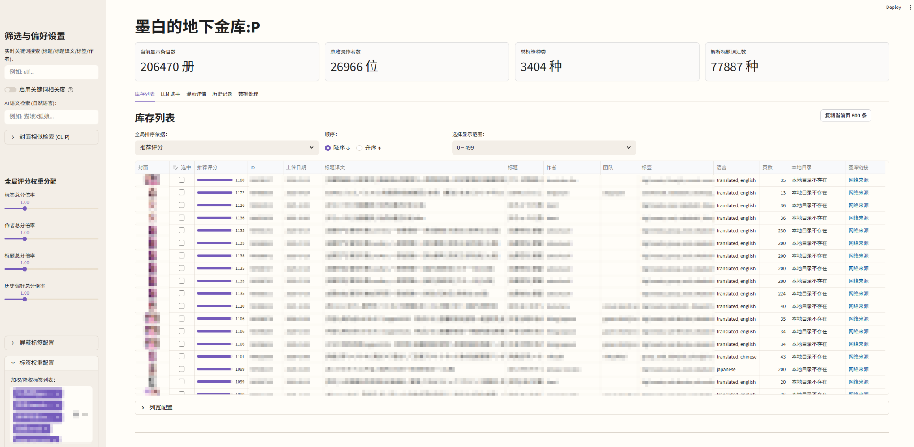
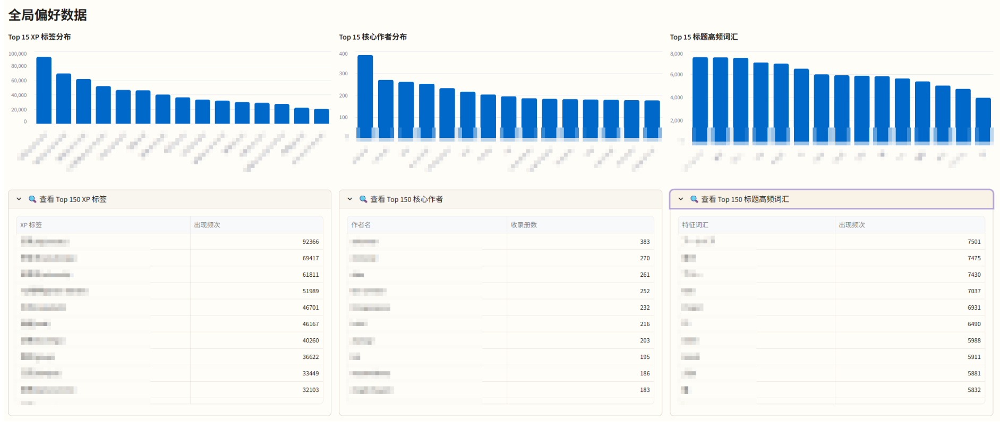
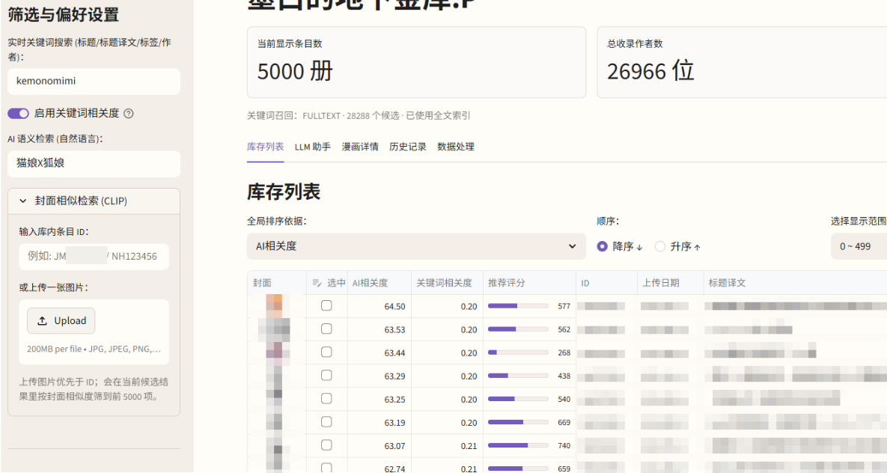
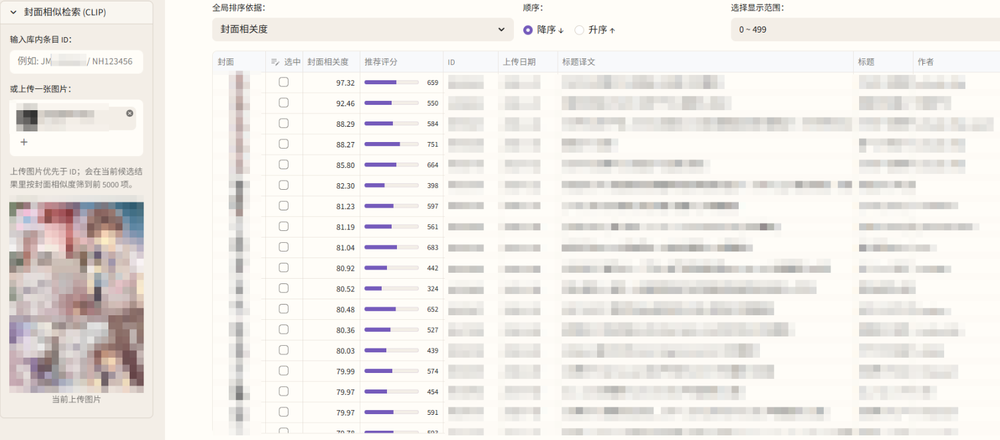
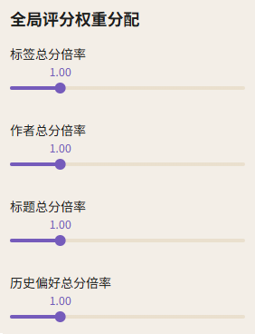
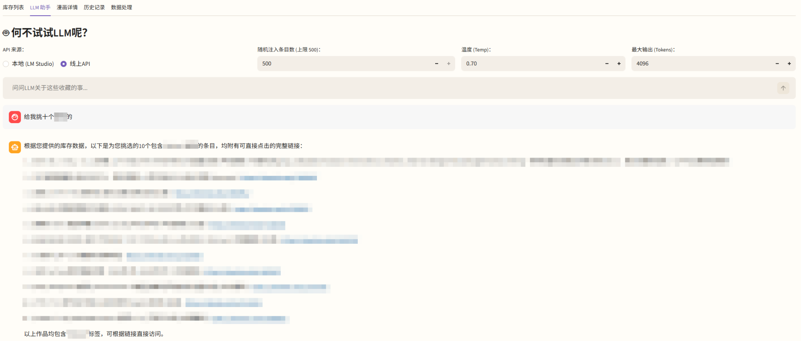
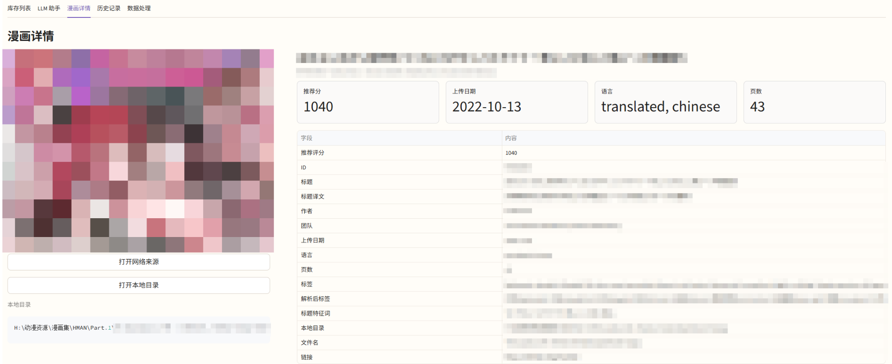
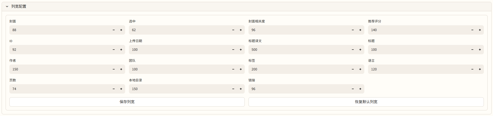
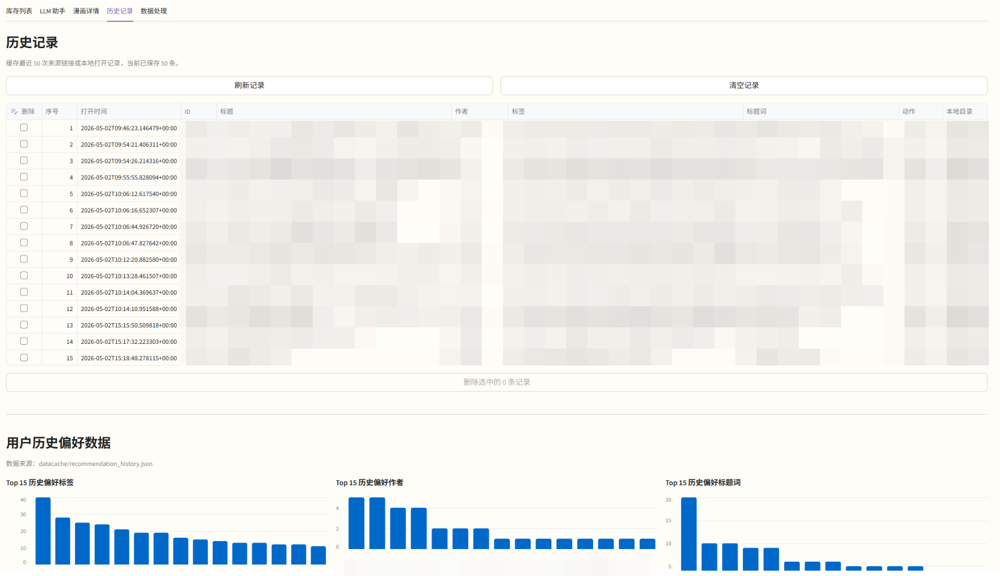
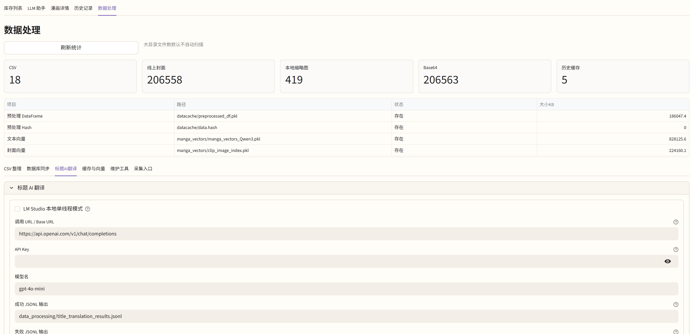

# XP-Gacha / 地下金库

## 新版一体化启动（React + FastAPI + MySQL）

新版保留原 Streamlit 的检索、动态评分、语义/封面相似搜索、详情、历史偏好、图表、LLM 问答和全部数据处理入口，界面使用 `web`。FastAPI 同时提供 API 与静态前端，因此部署后只有一个 Web 入口。

Windows 推荐直接运行：

```powershell
./scripts/start.ps1
```

或手动执行 `Copy-Item .env.example .env` 后运行 `docker compose up --build -d`。打开 `http://127.0.0.1:8000`，首次启动后进入“附录”，上传包含 CSV 与标准词典的 ZIP、上传单个 CSV，或点击“导入项目 data/gallery_info”。默认增量写入；覆盖重建需要再次确认。

MySQL 8.4 已包含在 Compose 中，数据保存在命名卷 `xp-gacha_mysql-data`；宿主机默认只在 `127.0.0.1:3307` 暴露数据库端口。漫画目录、数据库密码、LM Studio 和线上兼容 API 均在 `.env` 中配置。

不使用 Docker 时：

```powershell
pnpm --dir web install
pnpm --dir web build
python -m pip install -r requirements.txt
python launcher.py
```

API 文档位于 `http://127.0.0.1:8000/api/docs`。旧 `streamlit run app.py` 入口仍保留，便于过渡和功能对照。

争做最强大的本子推荐系统（误

一个基于 `Streamlit` 的本地（正经？）漫画库存管理、检索与推荐系统。

将「在线抓取 / 本地链接整理 / CSV 清洗 / MySQL 入库 / 标题分词 / 标签语义聚合 / 向量语义检索 / LLM 问答」串成了一条完整流程，搭建个人专属本子资料库、个人 XP 标签筛选器和线上&本地图库浏览器。

当前实现明显偏向 Windows 本地环境使用：

- 支持直接打开本地文件夹（`os.startfile`）
- 默认配置里使用了 Windows 绝对路径
- 本地模型与图库目录默认按本地磁盘组织

## 界面预览




## ✨ 功能概览

- 基于 MySQL 数据库读取漫画元数据，并缓存预处理结果与评分矩阵
- 按标签、作者、标题关键词和历史打开偏好进行动态推荐评分
- 标签/标题评分基于语义聚合后的标签/关键词词频
- 支持记录最近 N 次点击来源链接/打开本地目录，并基于历史偏好自动加权推荐
- 支持屏蔽标签、权重调节、分数阈值筛选
- 支持 MySQL 关键词候选召回，优先使用 `FULLTEXT` 全文索引，支持检索 `ID`, `标题`, `标题译文`, `标签`, `作者`, `团队`
- 关键词搜索结果支持可选的 `关键词相关度` 列；关闭时不会让数据库额外计算全文相关度
- 支持本地向量模型的自然语言语义检索，向量文本会纳入 `标题译文`
- 支持上传图片或输入库内 `ID` 的封面相似检索（CLIP）
- 支持展示封面缩略图、来源链接和本地目录，并可一键复制库存列表当前页内容
- 库存列表支持手动保存列宽配置到 `.streamlit/library_column_widths.json`，下次启动自动加载
- 主界面支持勾选漫画；选中只用于详情查看，不会写入历史记录
- 漫画详情页集中展示主列表未展开的完整信息，并提供本地目录打开入口
- LLM 助手、漫画详情、历史记录、数据处理均已拆成独立页面
- 支持全局偏好图表和历史偏好图表，均提供 Top 15 图表与 Top 150 展开表
- 支持将当前筛选结果注入给 LLM 做RAG增强检索问答，注入字段包含 `标题译文`，并兼容部分接口流式返回空片段
- 支持 nhentai源(以下简称`NH`) / 禁漫天堂源(以下简称`JM`) 双源抓取、修复抓取和本地链接补抓
- 数据处理页支持数据抓取、全量导库、增量导库、MySQL 表结构与全文索引优化、标题 AI 翻译、向量库重建、封面 Base64 预编码、缓存维护、脚本实时输出等功能

### 全文索引&语义向量混合检索排序



### 封面相似度检索排序



### 全局权重分配/标签屏蔽/权重调节/评分下限屏蔽



### RAG-LLM检索对话



### 漫画详情与本地路径打开



### 表格列宽配置



## 🧭 页面与交互

页面当前支持：

- `库存列表`：推荐评分排序、ID / 标题 / 标题译文 / 标签 / 作者 / 团队关键词检索、关键词相关度开关、选中漫画、来源链接、本地目录列、封面缩略图显示、列宽配置保存，并支持一键复制当前页列表信息
- `漫画详情`：展示当前选中漫画的完整信息，左侧显示封面与本地目录打开入口
- `LLM 助手`：将当前结果集注入 LLM-RAG 问答，参考库存数据中包含 `标题译文`
- `历史记录`：刷新历史记录、清空历史记录、查看和删除历史条目
- `数据处理`：CSV 整理、数据库同步、标题AI翻译、缓存与向量、维护工具、采集入口，以及每个脚本的实时输出
- 侧边栏：标签屏蔽，标签/作者/标题权重调节，历史偏好总分倍率调节
- AI 语义检索
- 封面相似检索（支持上传图片，或输入库内已有条目的 `ID` 直接使用其封面做相似检索）
- 点击库存列表中的来源链接，并记录历史偏好
- 在漫画详情页一键打开本地漫画目录，并记录历史偏好
- 全局偏好统计图表
- 用户历史偏好统计图表

库存列表底部有 `列宽配置` 折叠面板，可以手动设置各列像素宽度并保存到：

```text
.streamlit/library_column_widths.json
```

之后重新打开应用会自动加载这些列宽。Streamlit 当前不会把前端拖拽列宽回传给 Python，因此这里采用的是“表单保存列宽”的持久化方式。

## 🧮 推荐评分算法

推荐分当前由四部分组成：

- 标签分：基于语义聚合后的标签词频、标签权重和全局倍率
- 作者分：基于作者出现频次和作者偏好倍率
- 标题分：基于标题分词后的高频词和词权重
- 历史偏好分：基于最近 N 次点击来源链接或打开本地目录的条目，额外奖励这些条目里相对小众的标签、标题词和作者

当前实现为了减少大数据量下的权重拖动延迟，已经将评分链路改为“预处理阶段编码，交互阶段批量计算”：

- 预处理缓存中会额外保存标签稀疏矩阵、标题词稀疏矩阵、作者索引编码、每行标签数/标题词数等评分缓存
- 预处理缓存中还会保存 `ID -> 行号` 映射，用于把数据库召回的候选 ID 快速切成候选行
- 运行时会把用户侧边栏输入的动态权重字典转成权重向量
- 标签分与标题分通过稀疏矩阵乘法批量计算
- 作者分通过作者索引数组直接查表计算
- 历史偏好分也复用同一套标签/标题词稀疏矩阵和作者索引编码，不逐行扫描全表
- 有关键词候选集时，推荐评分只对候选行切片计算，而不是强制对全库打分
- 最终仍保持和原先逐行评分一致的公式口径与整数结果

也就是说，当前 `apply_dynamic_scores()` 已不再逐行 `DataFrame.apply(axis=1)` 评分，而是基于 `numpy + scipy.sparse.csr_matrix` 批量完成整列推荐分计算。

## 🔎 检索与性能机制

当前主界面的检索链路不是单纯的 Pandas 全表字符串扫描：

1. 启动时从 MySQL 读取 `gallery_info`，生成预处理 DataFrame、词频统计、图表缓存和评分矩阵缓存。
2. 用户输入普通关键词时，先由 MySQL 召回候选 `ID`。
   - 如果存在 `ft_gallery_search`，优先走 `FULLTEXT`。
   - 全文索引字段为 `标题`、`标题译文`、`标签`、`作者`、`团队`。
   - 如果全文索引不存在或没有命中，会回退到 `LIKE`。
   - `LIKE` 回退也会在当前数据库实际存在的 `标题译文` 列中搜索。
3. 应用把候选 `ID` 映射到预处理 DataFrame 行号，只对候选集进行推荐评分。
4. 页面展示时仅对当前分页的 `ID` 批量读取一次 MySQL 原始行，再加载当前页封面。
5. 关键词召回结果会按“搜索词 + 是否启用关键词相关度”缓存在当前 Streamlit 会话中；调权重时不会重复查 MySQL。

侧边栏中的 `启用关键词相关度` 控制数据库是否计算全文相关度：

- 关闭：只召回候选 `ID`，不计算 `MATCH ... AGAINST` 分数，也不会显示 `关键词相关度` 列。
- 开启：会额外计算全文相关度，显示 `关键词相关度` 列，并允许按该列排序。

AI 语义检索和封面相似检索仍然是当前结果集上的二次过滤。文本语义向量构建时会把 `标题译文` 拼入语料，因此翻译更新后建议重建一次文本向量库。它们会缓存最近一次“查询词/图片 + 候选 ID 集合”的结果；如果调权重导致候选 ID 集合变化，可能会重新计算相似度。

### 历史偏好加权



应用会把最近 `HISTORY_RECOMMENDATION_CACHE_SIZE` 次通过页面打开的条目记录到 `datacache/recommendation_history.json`：

- 点击库存列表中的 `图库链接 -> 网络来源`
- 在漫画详情页点击 `打开本地目录`

库存列表里的 `选中` 只用于切换当前漫画详情，不会写入历史记录，也不会影响历史偏好统计。

每条历史记录会保存：

- `ID`
- `标题`
- `作者`
- `链接`
- `本地目录`
- 过滤并语义聚合后的 `tags`
- 过滤并语义聚合后的 `title_words`

历史分先对历史记录中的每个特征计算 `feature_bonus`：

```text
feature_bonus =
历史出现次数
* log(1 + (该类别总数据库出现次数 + 1) / (该特征数据库出现次数 + 1))
* 对应类别全局倍率
```

其中：

- 标签历史倍率 = 侧边栏 `标签总分倍率`
- 作者历史倍率 = 侧边栏 `作者总分倍率`
- 标题词历史倍率 = 侧边栏 `标题总分倍率`

也就是说，同样被打开过的特征，在总数据库里越少见，历史加成越高；越常见，历史加成越低。最终每个条目的历史分会再乘以侧边栏的 `历史偏好总分倍率`，设为 `0` 即完全关闭历史偏好加权。

库存列表中的网络来源点击通过本地追踪重定向记录历史，默认监听：

```text
127.0.0.1:8765
```

如果该端口被占用，来源链接仍会直接打开，但网络链接点击不会写入历史记录；漫画详情页里的本地目录打开记录不受影响。

默认展示排序为：

- `推荐评分` 降序
- 次级 `上传日期` 降序

## 🗂️ 项目结构

```text
XP-Gacha/
├─ app.py                                  # 本地主界面
├─ ui_data_processing.py                   # 数据处理可视化页面与脚本输出
├─ config_empty.py                         # 配置模板
├─ config.py                               # 本地实际配置
├─ data_pipeline.py                        # 数据读取、缓存、标签/标题处理、动态评分
├─ utils_charts.py                         # 全局/历史偏好图表统计与渲染
├─ utils_core.py                           # 本地目录匹配、封面缩略图与 Base64 缓存
├─ utils_history.py                        # 历史打开记录、来源链接追踪与历史偏好加权
├─ utils_nlp.py                            # 标题分词、语义检索模型加载
├─ utils_cv.py                             # CLIP 封面向量读取、上传图/ID 相似检索
├─ utils_chat.py                           # LLM 对话与流式输出
├─ data_processing/
│  ├─ img_to_vector.py                     # 构建/查询 CLIP 封面向量索引
│  ├─ add_csv_to_mysql.py                  # 增量导库
│  ├─ addname.py                           # 从本地链接列表补文件名
│  ├─ all_csv_to_mysql.py                  # 全量导库
│  ├─ b64_pre_encode.py                    # 预编码 Base64 缓存
│  ├─ build_vector_db.py                   # 重建向量库
│  ├─ optimize_mysql_schema.py             # 优化 gallery_info 字段类型、主键与 FULLTEXT 索引
│  ├─ translate_titles.py                  # 批量调用 OpenAI 兼容接口生成标题译文
│  ├─ map_add_name.py
│  ├─ tag_set.py
│  └─ title_cut_set.py
├─ .streamlit/
│  ├─ config.toml                          # Streamlit 主题配置
│  ├─ library_column_widths.json            # 库存列表列宽配置，应用内保存后生成
│  └─ secrets.toml                         # MySQL 密钥配置
├─ dictionaries/                           # 停用词、语义映射等字典资源
├─ data/
│  ├─ gallery_info/                        # 标准化 CSV
│  ├─ gallery_info_no_name/                # 原始抓取 CSV
│  └─ local_data/                          # 本地链接列表输入
├─ data_get/
│  ├─ NH_get_info_online.py                # NH 在线抓取
│  ├─ NH_get_info_online_fix.py            # NH 失败页重试
│  ├─ JM_get_info_online.py                # JM 在线抓取
│  ├─ JM_get_info_online_fix.py            # JM 失败页重试
│  └─ local/
│     ├─ NH_get_info_local.py              # NH 本地链接抓信息
│     └─ NH_get_images_local.py            # NH 本地链接抓完整漫画
├─ tools/                                  # 工具脚本
│  ├─ clean_failed_title_translation_jsonl.py
│  ├─ clear_title_translation_by_error_ids.py
│  └─ delete_gallery_rows_by_id.py
├─ Integration/
│  ├─ ScoringFormula_local.py              # 本地整合版(old)
│  └─ ScoringFormula_online.py             # 线上整合版
├─ manga_vectors/                          # 文本语义向量与图片向量索引
├─ models/                                 # 本地模型统一存放目录
│  ├─ Qwen3-Embedding-0.6B/                # embedding 预训练模型
│  └─ clip-vit-base-patch32/               # CLIP 预训练模型
├─ onlineimgtmp/                           # 在线封面缩略图缓存
├─ localimgtmp/                            # 本地封面缩略图缓存
├─ b64_cache/                              # Base64 封面缓存
├─ b64_tmp/                                # Base64 增量临时目录
└─ datacache/                              # DataFrame 预处理缓存
```

### 数据流

1. 通过 `NH` / `JM` 抓取脚本或本地链接脚本生成 CSV。
2. CSV 统一规范到 `ID` 首列。
3. 将 `data/gallery_info/*.csv` 导入 MySQL 表 `gallery_info`。
4. 数据库表以 `ID` 为主键或唯一索引，并在 `标题` 后保留 `标题译文` 列。
5. 可用标题 AI 翻译脚本批量生成 `标题译文`，成功与失败批次分别写入 JSONL，便于审查和重试。
6. 建立包含 `标题译文` 的 `ft_gallery_search` 全文索引。
7. 用数据库数据构建向量库，向量 `ids` 也使用 `ID`，向量文本包含 `标题译文`。
8. 启动 `app.py` 后，从数据库读取数据并做预处理缓存。
9. 普通关键词先由 MySQL 召回候选 `ID`，再对候选集进行推荐评分。
10. 页面中按照推荐评分、关键词、语义检索、封面相似检索结果进行筛选和展示。
11. 当前分页会按 `ID` 批量读取 MySQL 原始行，缩略图显示优先命中 Base64 缓存，其次在线图，最后本地图回退。
12. 点击来源链接或在漫画详情页打开本地目录时，会把条目的聚合标签、标题词、作者等写入 `datacache/recommendation_history.json`，供历史偏好加权和历史偏好图表使用；仅勾选漫画不会写入历史。

## 💻 运行环境

建议环境：

- Python `3.10+`
- Windows
- 可用的 MySQL 实例
- 本地 embedding 模型
- 本地 CLIP 模型
- 如需本地LLM聊天：已启动的 `LM Studio` 兼容接口
- 可选：Docker Desktop + WSL2，用于容器化启动

## ⚙️ 如何开始

### 1. 创建 `config.py`

```powershell
copy config_empty.py config.py
```

然后按本机环境修改：

- `BASE_DIR`：本地漫画根目录
- `LOCAL_MODEL_PATH`：本地 embedding 模型目录，默认 `models/Qwen3-Embedding-0.6B`
- `VECTOR_FILE`：文本语义向量文件输出位置
- `IMG_VECTOR_FILE`：封面向量索引文件位置
- `CLIP_MODEL_PATH`：本地 CLIP 模型目录，默认 `models/clip-vit-base-patch32`
- `SEMANTIC_SEARCH_TOP_K`：语义检索最多保留的候选数
- `COVER_SEARCH_TOP_K`：封面相似检索最多保留的候选数
- `LM_STUDIO_API_BASE` / `LM_STUDIO_MODEL`：本地 LLM 助手和标题翻译 `--lm-studio` 模式使用
- `ONLINE_API_BASE` / `ONLINE_API_KEY` / `ONLINE_MODEL`：线上 LLM 助手默认配置
- `INITIAL_TAG_WEIGHTS`
- `MAX_DISPLAY`
- `HISTORY_RECOMMENDATION_CACHE_SIZE`：参与历史偏好加权的最近打开记录数上限
- `HISTORY_CACHE_FILE`：历史打开记录文件，默认 `datacache/recommendation_history.json`
- `HISTORY_LINK_TRACKING_HOST` / `HISTORY_LINK_TRACKING_PORT`：来源链接点击追踪的本地监听地址

### 2. 配置数据库密钥

`.streamlit/secrets.toml`：

```toml
[mysql]
user = "your_database_name"
password = "your_database_password"
host = "127.0.0.1"
port = 3306
database = "gallery_info"
```

Docker模式下，如果 MySQL 仍运行在 Windows 宿主机上，地址要写成：

```toml
[mysql]
user = "your_database_name"
password = "your_database_password"
host = "host.docker.internal"
port = 3306
database = "gallery_info"
```

如果 MySQL 也放进同一个 `docker-compose.yml`，则 `host` 应改成 MySQL 服务名。

### 3. 自定义主题色

项目使用 `Streamlit` 的项目级主题配置文件：

- `.streamlit/config.toml`

当前仓库已经内置了一套浅色和深色主题，你可以直接修改里面的颜色值：

```toml
[theme]
primaryColor = "#755bbb"

[theme.light]
backgroundColor = "#FFFDF8"
secondaryBackgroundColor = "#F3EEE7"
textColor = "#1F1F1F"
borderColor = "#D9D1C7"

[theme.dark]
backgroundColor = "#121714"
secondaryBackgroundColor = "#1D2520"
textColor = "#EAF2EC"
borderColor = "#334039"
```

各字段含义：

- `primaryColor`：主强调色，影响按钮、链接、高亮控件等
- `backgroundColor`：页面主背景色
- `secondaryBackgroundColor`：侧边栏、输入框、面板等区域背景色
- `textColor`：主要文字颜色
- `borderColor`：边框颜色

使用方式：

1. 打开 `.streamlit/config.toml`
2. 修改浅色或深色主题下对应的颜色值
3. 保存文件
4. 刷新页面；如果没有立即生效，重启 `streamlit run app.py`

深浅色模式切换：

- 应用右上角 `⋮` -> `Settings`
- 在 `Theme` 中切换 `Light` / `Dark`

### 4. 准备字典与模型资源

默认会读取：

- `dictionaries/STOP_TAGS.txt`
- `dictionaries/SEMANTIC_MAP.json`
- `dictionaries/TITLE_STOP_WORDS.txt`
- `dictionaries/TITLE_SEMANTIC_MAP.json`
- `config.py` 中指定的本地 embedding 模型目录与本地 CLIP 模型目录

本地下载的模型统一放在项目根目录的 `models/` 下。默认使用下面两个目录，其他本地模型也建议继续放在 `models/` 内：

```text
models/
├─ Qwen3-Embedding-0.6B/
└─ clip-vit-base-patch32/
```

## 🚀 启动应用

### 本机 Python 运行

适合在 Windows 本机直接运行，支持 `os.startfile` 打开本地漫画目录。

安装依赖：

```bash
pip install -r requirements.txt
```

如果你手动装包，至少需要：

```bash
pip install streamlit pandas numpy scipy sqlalchemy pymysql pillow janome sentence-transformers torch requests curl-cffi beautifulsoup4 cloudscraper tomli
```

如果你要使用 `data_processing/img_to_vector.py` 或主界面的封面相似检索，还需要：

```bash
pip install transformers
```

启动应用：

```powershell
streamlit run app.py
```

启动后访问：

```text
http://localhost:8501
```

### Docker 运行

适合在 Docker Desktop 的 Linux containers / WSL2 模式下运行。项目已提供 `Dockerfile`、`docker-compose.yml` 和 `config_docker.py`，镜像中只包含代码与运行环境，模型、向量、缓存、CSV、封面图和数据库密钥通过宿主机目录挂载。

首次启动或依赖变更后启动：

```powershell
docker compose up -d --build
```

日常后台启动：

```powershell
docker compose up -d
```

停止：

```powershell
docker compose down
```

查看日志：

```powershell
docker compose logs -f
```

启动后访问：

```text
http://localhost:8501
```

容器默认把以下目录挂载到 `/app` 下，相关文件仍保留在宿主机项目目录中，不会被打进镜像：

```text
.streamlit/
b64_cache/
b64_tmp/
data/
datacache/
dictionaries/
localimgtmp/
logs/
manga_vectors/
models/
onlineimgtmp/
```

Docker 版默认使用 `config_docker.py` 生成容器内的 `config.py`，常用配置可以通过 `docker-compose.yml` 的 `environment` 覆盖：

```yaml
environment:
  XP_GACHA_BASE_DIR: /library
  LM_STUDIO_API_BASE: http://host.docker.internal:5555/v1
```

如需让容器读取真实本地漫画目录，在 `docker-compose.yml` 中取消并修改示例挂载：

```yaml
volumes:
  - H:/动漫资源/漫画集/HMAN:/library:ro
```

注意：Docker Linux 容器不能直接调用 Windows 的资源管理器。漫画详情页点击“打开本地目录”时会记录历史并显示路径，但在容器环境中需要手动复制路径打开。

## 📖 字典与 XP 语义聚合说明

`dictionaries/` 里当前主要有 4 个文件：

- `STOP_TAGS.txt`
  标签停用词表。
  主要用于在标签评分前剔除“噪声标签”或“非偏好标签”，例如语言标记、翻译标记、作品形态、活动编号、吐槽性标签等。
  文件格式是一个 Python 风格的字符串列表片段，项目会用正则提取其中的单引号内容。
  简单示例：
  ```text
  'english', 'translated', 'full color', 'anthology', 'c105'
  ```
  表示这些标签在后续标签统计和评分前会先被过滤掉。
  影响范围：
  `data_pipeline.py`、`Integration/ScoringFormula_online.py` 等标签预处理流程。

- `SEMANTIC_MAP.json`
  标签语义聚合词典。
  用来把不同写法、近义词、上下位词、英日中混写标签映射到统一标签。
  简单示例：
  ```json
  {
    "school uniform": "制服",
    "uniform": "制服",
    "glasses": "眼镜"
  }
  ```
  表示原始标签里的 `school uniform` 和 `uniform` 最终都会按 `制服` 这个统一标签统计。
  这份词典直接影响“标签词频统计”和“推荐评分”。
  影响范围：
  标签聚合、侧边栏标签选项、标签权重配置、屏蔽标签、推荐评分。

- `TITLE_STOP_WORDS.txt`
  标题分词停用词表。
  用来过滤标题中的高频虚词、语气词、标点、编号、翻译标记、无实际偏好意义的常见碎词，降低标题词频噪声。
  文件格式和 `STOP_TAGS.txt` 一样，也是通过正则抽取单引号内容。
  简单示例：
  ```text
  'dl版', '翻译', '第1话', 'vol', 'the', 'and'
  ```
  表示这些词即使在标题里出现，也不会进入标题特征词统计。
  影响范围：
  标题特征词抽取、标题词频统计、标题加权评分。

- `TITLE_SEMANTIC_MAP.json`
  标题语义聚合词典。
  用来把标题分词结果中的近义词或不同写法统一到同一个关键词上。
  简单示例：
  ```json
  {
    "変化": "变身",
    "变身": "变身",
    "眼鏡": "眼镜"
  }
  ```
  表示标题分词时，如果抽到 `変化` 或 `变身`，最后都会统一按 `变身` 统计。
  影响范围：
  标题特征词统计、标题权重配置、标题分推荐分。

*注：若想跳过字典编写阶段直接获得字典，请移步tools/datasets.txt*

### 字典实际生效顺序

标签链路：

1. 读取原始 `标签`
2. 用 `STOP_TAGS.txt` 过滤噪声标签
3. 用 `SEMANTIC_MAP.json` 做语义映射
4. 统计聚合后的标签词频
5. 用聚合后的标签参与推荐评分

标题链路：

1. 对 `标题` 分词
2. 用 `TITLE_STOP_WORDS.txt` 过滤噪声词
3. 用 `TITLE_SEMANTIC_MAP.json` 做语义映射
4. 统计聚合后的标题词频
5. 用聚合后的标题词参与推荐评分

### ⚠️ 修改词典后的影响

如果你改了 `dictionaries/` 下的词典：

- `app.py` / `data_pipeline.py` 的预处理缓存会因为哈希变化自动失效并重建
- 标签和标题的推荐评分结果会变化
- 侧边栏里可选的标签、标题词也可能变化
- 已构建的向量库不会因为这些词典自动重建

也就是说：

- 改标签/标题评分逻辑：通常不需要重建向量库
- 改数据库内容或想让语义检索语料同步：需要重跑 `data_processing/build_vector_db.py`

## 🛠️ 数据准备与维护



推荐优先使用应用内的 `数据处理` 页面操作。该页面已经把常用流程做成可视化表单，并提供脚本实时输出：

- CSV 整理：补文件名、标签/标题词整理、Base64 预编码等
- 数据库同步：全量导入 MySQL、增量同步 MySQL、优化 MySQL 表结构与全文索引
- 标题AI翻译：按序号范围批量调用 OpenAI 兼容接口，将标题中文译文写入 MySQL，并同步保存成功/失败 JSONL
- 缓存与向量：重建文本向量库、构建/查看封面图片向量索引
- 维护工具：刷新缓存统计、清理缓存、合并 Base64 增量缓存、清理标题翻译 JSONL、按 ID 删除数据库条目、按 `error.json` 清空标题译文
- 采集入口：NH/JM 在线抓信息、失败页重试、NH 本地链接抓信息、NH 本地链接抓完整漫画

采集入口里的链接、起始网址、保存 CSV 路径、抓取页数、线程数、错误日志、失败报告等参数都可以直接在页面里填写。脚本内也保留了同名全局变量，方便直接运行脚本或临时覆写。

### NH 在线抓取

循环抓取指定页数范围，自动写入 `ID`、下载缩略图，并按 `ID` 查重：

```powershell
python data_get/NH_get_info_online.py --max-page 100 --start-url "https://nhentai.net/language/chinese/?sort=date" --output-csv "gallery_info_chinese.csv" --image-dir "onlineimgtmp" --error-log "logs/NH_error_log_online.txt" --max-workers 10 --once
```

### NH 失败页重试

按错误页重试，并继续按 `ID` 查重：

```powershell
python data_get/NH_get_info_online_fix.py
```

可在脚本顶部全局变量或 `数据处理` 页面里调整读取的错误日志、重试错误日志、输出 CSV、缩略图目录、起始网址等参数。

### JM 在线抓取

抓取JM数据，自动写 `JM...` 的 `ID`，自动清洗语言标签和上传日期：

```powershell
python data_get/JM_get_info_online.py
```

可在脚本顶部全局变量或 `数据处理` 页面里调整 `BASE_URL`、`START_URL`、`MAX_PAGES`、`CSV_PATH`、`OUTPUT_DIR`、`MAX_WORKERS` 等参数。

### JM 失败页重试

从指定错误日志里提取失败页码，按首次出现顺序去重后，只重爬这些页：

```powershell
python data_get/JM_get_info_online_fix.py
```

可在脚本顶部全局变量或 `数据处理` 页面里调整读取的错误日志、重试日志、失败页报告 CSV、输出 CSV、起始网址等参数。

### NH 本地链接抓信息

如果你已经有本地链接列表：

```powershell
python data_get/local/NH_get_info_local.py
```

可在脚本顶部全局变量或 `数据处理` 页面里调整输入链接文件、输出 CSV、错误日志、请求间隔等参数。

### NH 本地链接抓完整漫画

```powershell
python data_get/local/NH_get_images_local.py
```

可在脚本顶部全局变量或 `数据处理` 页面里调整输入链接文件、本地漫画根目录、错误日志、最大页数、请求间隔与重试次数等参数。

### 给 CSV 补文件名

用于把本地链接列表中的文件夹名补回 CSV，生成 `*_full.csv`：

```powershell
python data_processing/addname.py
```

### 全量导入 MySQL

会读取 `data/gallery_info/*.csv`，规范列后覆盖写入 `gallery_info`：

```powershell
python data_processing/all_csv_to_mysql.py
```

当前会：

- 自动补缺失 `ID`
- 在 `标题` 后保留 `标题译文` 列
- 按 `ID` 去重
- 优化 `gallery_info` 字段类型
- 将 `ID` 优化为主键或唯一索引
- 建立 `ft_gallery_search` 全文索引，用于关键词候选召回

### 增量同步到 MySQL

```powershell
python data_processing/add_csv_to_mysql.py
```

当前会：

- 自动补缺失 `ID`
- 按 `ID` 去重
- 按 `ID` 的主键 / 唯一索引做增量插入与更新
- CSV 未提供 `标题译文` 时保留数据库里已有的标题译文
- 同步完成后自动执行表结构与全文索引优化

### 标题 AI 翻译

读取 `gallery_info` 中的 `标题`，按 ID 排序后的序号范围筛选，将多个标题拼成一组请求 OpenAI 兼容的 Chat Completions 接口，并把返回的 JSON 拆分写入 `标题译文`。已有 `标题译文` 的条目会自动跳过。

当前行为：

- 多个标题组成一批请求，`--batch-size` 控制每批数量
- 线上接口可用 `--concurrency` 并发多个批次
- `--start-index` / `--end-index` 控制按 ID 排序后的翻译序号范围
- 每个成功批次会追加到成功 JSONL，默认 `data_processing/title_translation_results.jsonl`
- 失败批次会单独追加到 `data_processing/title_translation_failed_results.jsonl`
- `429 Too many requests` 会用短错误输出，便于看日志
- 内容安全拒绝、HTTP 错误、格式错误等不会写入数据库，只会进入失败 JSONL
- 返回字段兼容 `title_zh`，也兼容部分模型误返回的 `title`
- 如果只想先审查 JSONL，不写数据库，可追加 `--jsonl-only` 或 `--no-db-write`

```powershell
python data_processing/translate_titles.py --api-url "https://api.openai.com/v1/chat/completions" --api-key "sk-..." --model "gpt-4o-mini" --batch-size 20 --concurrency 3 --start-index 1 --end-index 200 --jsonl-output "data_processing/title_translation_results.jsonl" --failed-jsonl-output "data_processing/title_translation_failed_results.jsonl"
```

`--api-url` 可填完整 `/chat/completions` 地址，也可填 OpenAI 兼容 Base URL。`--api-key` 为空时会读取 `OPENAI_API_KEY`。

本地 LM Studio 单线程模式示例：

```powershell
python data_processing/translate_titles.py --lm-studio --batch-size 5 --start-index 1 --end-index 50 --jsonl-only
```

启用 `--lm-studio` 时默认读取 `config.py` 里的 `LM_STUDIO_API_BASE` / `LM_STUDIO_MODEL`，API Key 可为空，并强制单线程请求；如果命令行显式传入 `--api-url` 或 `--model`，则以命令行参数为准。

应用内 `数据处理 -> 标题AI翻译` 选项卡也提供同样参数。勾选 `LM Studio 本地单线程模式` 后，URL 和模型名直接读取 `config.py`，并强制单线程，适合本地 LM Studio 兼容接口。

### 优化 MySQL 表结构与全文索引

如果数据库是旧版本表结构，或你想单独补建全文索引，可以执行：

```powershell
python data_processing/optimize_mysql_schema.py
```

当前会尝试：

- 清理并优化 `ID` 字段，优先将 `ID` 设置为主键
- 补齐 `标题译文` 列，并缩短明显不需要 `TEXT` 的字段类型，例如 `链接`、`标题`、`标题译文`、`语言`、`上传日期`
- 将 `页数` 优化为整数类型
- 创建 `ft_gallery_search` 全文索引：

```sql
FULLTEXT INDEX ft_gallery_search (`标题`, `标题译文`, `标签`, `作者`, `团队`) WITH PARSER ngram
```

如果当前 MySQL 环境不支持 `ngram` parser，脚本会回退为普通 `FULLTEXT` 索引。首次建索引会对整张 `gallery_info` 扫描，数据量大时需要等待一段时间。

### 重建向量库

读取 MySQL 中 `gallery_info`，并以 `ID` 作为向量主键：

```powershell
python data_processing/build_vector_db.py
```

当你改了数据库主键逻辑、更新了大量数据、或者刚跑完全量导库后，建议重建一次。
如果批量更新了 `标题译文`，也建议重建一次，因为文本语义向量会纳入 `标题译文`。

常用参数示例：

```powershell
python data_processing/build_vector_db.py --model-path "models/Qwen3-Embedding-0.6B" --vector-file "manga_vectors/manga_vectors_Qwen3.pkl" --batch-size 16 --max-text-length 800
```

### 构建封面图片向量索引

读取 `onlineimgtmp/` 和 `localimgtmp/` 中的图片，并生成 CLIP 封面向量索引：

```powershell
python data_processing/img_to_vector.py build --device cuda --index-path manga_vectors/clip_image_index.pkl
```

补充说明：

- 首次全量构建会比较久，尤其当 `onlineimgtmp/` 图片很多时
- 支持 `Ctrl + C` 中断，已完成批次会保存在 `*.progress` 目录，下次继续跑会自动续建
- `--batch-size` 可调，例如 `--batch-size 128`
- 如果中途中断，可以直接再次执行同一条 `build` 命令继续；脚本会自动从进度目录续跑。也可以先看索引状态：

```powershell
python data_processing/img_to_vector.py stats --index-path manga_vectors/clip_image_index.pkl
```

终端查询单张图片时：

```powershell
python data_processing/img_to_vector.py search --query 你的查询图.jpg --top-k 20 --index-path manga_vectors/clip_image_index.pkl
```

### 预编码封面 Base64

```powershell
python data_processing/b64_pre_encode.py
```

会扫描：

- `onlineimgtmp`
- `localimgtmp`

并为 `ID.*` 图片生成对应的增量 Base64 文本缓存到 `b64_tmp` 文件夹下，检查无误后需手动拷贝至 `b64_cache` 文件夹下。

### 标题翻译维护工具

这些工具也已接入应用内 `数据处理 -> 维护工具` 选项卡。

清理标题翻译成功 JSONL 里混入的 `status == "failed"` 行，默认会生成 `.bak`：

```powershell
python tools/clean_failed_title_translation_jsonl.py --jsonl-path "data_processing/title_translation_results.jsonl"
```

按输入 ID 删除数据库中的整条 `gallery_info` 记录。默认只预览，确认删除必须追加 `--confirm`：

```powershell
python tools/delete_gallery_rows_by_id.py NH123456 NH234567 --confirm
```

也可以从文本文件读取 ID：

```powershell
python tools/delete_gallery_rows_by_id.py --id-file "tools/delete_ids.txt" --confirm
```

从 `tools/error.json` 中识别所有 `"id": "NH..."` 文本段，并清空这些 ID 的 `标题译文`。默认只预览，确认清空必须追加 `--confirm`：

```powershell
python tools/clear_title_translation_by_error_ids.py --input "tools/error.json" --confirm
```

默认清空为 `NULL`；如果想清空为空字符串，可追加 `--empty-string`。

*注：若想跳过数据爬取阶段直接获得数据，请移步tools/datasets.txt(无封面)*

## 🔑 核心约定

### `ID` 唯一标识

当前项目已统一以 `ID` 作为唯一标识：

- NH源：`NH123456`
- JM源：`JM123456`

应用者：

- CSV 首列
- MySQL 表 `gallery_info`
- 数据库主键 / 唯一索引
- MySQL `FULLTEXT` 关键词召回
- 向量库 `ids`
- 语义检索命中
- 缩略图文件名
- Base64 缓存文件名
- Streamlit 页面显示与本地打开逻辑

### 缩略图命名规则

- 在线缩略图：`onlineimgtmp/NH123456.jpg` 或 `onlineimgtmp/JM123456.png`
- 本地缩略图：`localimgtmp/NH123456.jpg`
- Base64 缓存：`b64_cache/NH123456.txt` 或 `b64_cache/JM123456.txt`

## 🖼️ 缩略图显示机制

`app.py` 当前只对当前分页的数据懒加载封面。

显示顺序是：

1. 读取 `b64_cache/ID.txt`
2. 如果没有，则读取 `onlineimgtmp/ID.*`
3. 如果还没有，则回退到本地目录里的 `1.*`
4. 本地目录回退时会生成 `localimgtmp/ID.jpg`
5. 如果本地全部落空，则从图源站点实时抓取封面（见下）
6. 最终结果会回写到 `b64_cache/ID.txt`

即，Base64 缓存是第一优先级，在线图是第二优先级，本地图是第三优先级，线上实时抓取是最后回退。

### 线上封面实时抓取

当 `b64_cache`、`onlineimgtmp`、本地目录都取不到某条目的封面（或 `b64_cache` 目录不存在）时，应用会直接从图源站点实时抓取：

- NH 源：先通过 `https://nhentai.net/api/v2/galleries/<画廊ID>` 把画廊 ID 换成缩略图 URL 实际使用的 `media_id`（两者不是同一个数字，旧版 `/api/gallery/` 接口作为回退），API 同时给出缩略图真实扩展名，再依次尝试 `https://t1~t5.nhentai.net/galleries/<media_id>/thumb.<ext>`
- JM 源：专辑 ID 即 JM ID 本身，依次尝试 `https://cdn-msp.18comic.vip` 与 `cdn-msp1~5` 镜像下的 `/media/albums/<专辑ID>.jpg/.webp/.png`

找到第一个可访问的组合即停止，抓到的图片会原子写入 `onlineimgtmp/ID.<ext>` 并回写 `b64_cache/ID.txt`，下次直接命中缓存。失败分两类：确定性失败（如 404，条目已被源站删除）的 ID 本次会话内不再重试；网络性失败（超时/连接失败）不拉黑 ID，短暂冷却后可重试。

加载方式是异步的：库存列表只用本地缓存快速渲染表格（不等网络），缺失封面的条目提交到后台线程池并发抓取，表格下方会提示后台抓取数量；抓取完成后点击「库存列表」标题右侧的「刷新封面」按钮手动刷新显示（不做自动轮询刷新，避免整页刷新重挂载表格打断正在进行的勾选操作）；漫画详情页则单条即时抓取，若同一封面正被后台抓取会等待其完成。

相关配置（`config.py`）：

- `ONLINE_COVER_FETCH_ENABLED`：是否启用实时抓取，默认 `True`
- `ONLINE_COVER_FETCH_CONCURRENCY`：后台并发抓取的线程数，默认 `6`（修改后需重启应用生效）
- `ONLINE_COVER_PROXY`：抓取走的代理，默认与爬虫一致的 `http://127.0.0.1:7890`，设为 `""` 表示直连；每次请求内代理与直连互为回退，成功的一侧成为下次首选。NH / JM 两个图源各自独立熔断：连续多次网络性失败后暂停该源约 10 分钟再自动恢复，互不影响

Docker 部署时两者均可用同名环境变量覆盖（`ONLINE_COVER_PROXY` 默认为空即直连，容器内走宿主机代理可设为 `http://host.docker.internal:7890`）。

## 缓存说明

项目当前主要有这几类缓存：

- `datacache/`
  预处理后的主缓存和用户历史记录目录。
  当前默认会把以下内容一起写入 `preprocessed_df.pkl`：
  - 预处理后的主 DataFrame
  - 标签 / 作者 / 标题词频次统计
  - 全局偏好排序图表所需的 Top 15 / Top 150 统计缓存
  - 动态评分所需的预编码评分缓存
  评分缓存当前包括：
  - 标签稀疏矩阵
  - 标题词稀疏矩阵
  - 作者索引编码
  - 每行标签数 / 标题词数对应的归一化因子
  - `ID -> 行号` 映射
  另外，`recommendation_history.json` 会单独保存最近打开记录，用于历史偏好加权和用户历史偏好图表；它不会写入 `preprocessed_df.pkl`，历史偏好图表在页面渲染时即时统计。
- `onlineimgtmp/`
  在线抓取到的缩略图
- `localimgtmp/`
  本地封面缩略图缓存
- `b64_cache/`
  最终供前端显示的 Base64 文本缓存
- `b64_tmp/`
  Base64 增量预编码临时目录
- `manga_vectors/*.pkl`
  语义向量缓存
- `manga_vectors/clip_image_index.pkl`
  封面图片向量索引缓存
- `data_processing/title_translation_results.jsonl`
  标题 AI 翻译成功批次记录，包含输入标题、原始返回 JSON、规范化译文字段和数据库写入数量
- `data_processing/title_translation_failed_results.jsonl`
  标题 AI 翻译失败批次记录，包含输入标题和错误原因，便于后续重试或清理
- `.streamlit/library_column_widths.json`
  库存列表列宽配置，使用列表下方的 `列宽配置` 面板保存后生成
- `*.pkl.progress/`
  `data_processing/img_to_vector.py` 构建封面向量时的断点续跑进度目录
- Streamlit 会话缓存
  主界面会缓存最近一次关键词数据库召回结果、动态评分结果、语义检索结果和封面相似检索结果。权重变化时，如果关键词和候选集签名没有变化，会尽量复用这些结果，减少重复数据库查询或向量计算。

数据库内容或字典文件变化后，应用会自动根据哈希重新生成预处理缓存。
如果只是代码升级导致缓存结构扩展，而底层数据未变化，应用会优先尝试基于旧缓存自动补齐新版缓存结构，而不一定重新全量读取数据库。

## ⚠️ 注意事项

- 当前实现对 Windows 更友好，尤其是“打开本地文件夹”功能。
- `BASE_DIR`、模型路径等默认值是本机路径，换机器必须修改。
- `app.py` 启动时会连接数据库；如果密钥或表不存在，页面会直接报错停止。
- 关键词检索建议执行一次 `data_processing/optimize_mysql_schema.py`，确保存在 `ft_gallery_search` 全文索引；没有全文索引时会自动回退到 `LIKE`，但宽泛关键词可能较慢。
- `启用关键词相关度` 会让 MySQL 额外计算并排序全文相关度。宽泛关键词命中很多时，开启它可能比只召回候选 `ID` 更慢。
- `标题译文` 更新后，关键词搜索会随数据库即时生效；AI 语义检索需要重建文本向量库才会纳入新译文。
- 语义检索依赖本地 embedding 模型和提前构建好的文本向量文件。
- 封面相似检索依赖本地 CLIP 模型与 `IMG_VECTOR_FILE` 指向的图片向量索引。
- 库存列表的来源链接点击追踪依赖本地 `HISTORY_LINK_TRACKING_HOST:HISTORY_LINK_TRACKING_PORT` 追踪服务，默认 `127.0.0.1:8765`；端口被占用时不会记录网络链接点击。
- 库存列表列宽保存采用应用内表单写入 `.streamlit/library_column_widths.json`；Streamlit 当前不会把鼠标拖拽后的列宽变化回传到 Python。
- 如果你的数据库结构发生变化，建议清空数据库，重新运行一次：

```powershell
python data_processing/all_csv_to_mysql.py
python data_processing/build_vector_db.py
```

- 在线抓取脚本默认代理地址写死为 `127.0.0.1:7890`，需要按实际网络环境调整。

## 💡 适合谁用

如果你想要一个高度个人化、可解释、XP 可量化调节、支持本地浏览、语义检索和 LLM 问答的绅士漫画库存检索系统，这个项目非常适合你。
